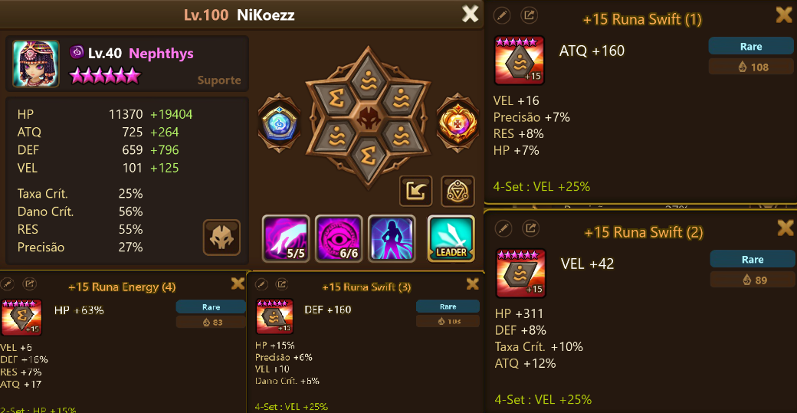

# Gerenciador de Runas do jogo Summoners Wars
## Identificação

- **Nome:** Marco Antônio da Rosa Soares
- **Curso:** Sistemas de Informação - 2025
- **Disciplina:** Paradigmas de Programação

## Tema/Objetivo

O projeto possui o objetivo de possibilitar ao usuário cadastrar suas runas em um banco de dados e requisitar que seja feito mostrado um conjunto com base em alguns requisitos implementados. O back-end foi feito em Haskell e o front-end foi desenvolvido em Elm.

### Explicação das runas do jogo:
  1) O jogo é composto de vários tipos de runas, (Ex: Violent, Swift, Fatal), esses conjuntos, quando equipados por completo, fornecem melhorias aos monstros, por exemplo, a Violent permite que um monstro ataque duas vezes com 12% de chance.
  2) Os monstros possuem 6 slots para serem colocadas as runas, cada runa possui 1 numeração, uma runa 1 pode ser equipada apenas no slot 1, da mesma maneira uma runa 4 só pode ser equipada no slot 4.
  3) Cada runa apresenta um atributo principal e quatro substatus, que podem variar de tipo e de qualidade.
A imagem a seguir apresenta a janela para equipar as runas no jogo, acredito que ela deve ajudar no entendimento



## Processo de Desenvolvimento

### Instalação e Configuração

Aqui acredito que foi um ponto de bastante dificuldade, tive bastante erros seguindo tutoriais e tentando entender o funcionamento do Scotty. Para resolver isso observei bastante os códigos dos colegas do ano passado, me inspirando principalmente na implementação do Scotty feita pela Luiza Manoelle (https://github.com/elc117/perso-2024b-luizamanoelle/tree/main)


Todo o setup e montagem do ambiente Haskell foi feito utilizando o Stack (https://docs.haskellstack.org/en/stable/), o que facilitou completamente, uma vez que ele monta todos os arquivos e o diretório já fica organizado corretamente.


Depois disso, entramos em uma das partes que eu tive maior dificuldade no trabalho, a conexão do Banco de Dados com o Haskell, primeiro a minha ideia era realizar a conexão com o BD, pegar as runas, fechar a conexão e ligar o servidor Scotty, mas posteriormente eu vi que não era possível dessa forma, sendo necessário manter os dois ativos, pelo que eu entendi. Dentro disso, foi necessário entender a ordem desses fatores, o que gerou alguns erros durante o caminho.


Por último, a instalação do Elm foi bastante simples, apenas baixando o executável no próprio site da ferramenta (https://elm-lang.org/).

### Instalação e Configuração
Aqui destaco alguns imports de maior importância, novamente destaco o papel dos códigos do ano anterior, onde fui lendo os trabalhos e entendendo o que estavam usando e o motivo, assim pude utilizar alguns no meu trabalho também. 
```haskell
import Database.PostgreSQL.Simple
import Database.PostgreSQL.Simple.FromRow
```
Essas duas foram utilizadas para a conexão com o PostGre.

```haskell
 import Web.Scotty
```
Biblioteca principal do Scotty.

```haskell
import Data.List (sortBy)
import Data.Ord (comparing)
import Data.List (maximumBy)
```
Bibliotecas com funções para trabalhar com listas, irei detalhar melhor na função específica que uso elas.

```haskell
import Control.Monad.IO.Class (liftIO)
```
Essa foi uma das partes que deu problema, mencionada anteriormente, é necessário usar essa função pra pegar as runas do Banco de Dados mesmo com o Scotty ligado.

### Desenvolvimento -> 1 Ideia
A primeira ideia, comentada com a professora, era justamente pegar as runas do BD, trazer para o Scotty, fazer todas as combinações possíveis e a partir dessas combinações, trabalhar com as melhores, o que era uma ideia que funcionava e que era bastante simples de ser implementada, uma vez que o haskell já possui uma função de fazer as combinações, que é o "sequence". Entretanto, a partir do momento que eu rodei a função e o programa crashou, investiguei e visualizei que o que eu estava tentando fazer era um fatorial do número de runas, ou seja, como eu tenho 496 runas, a conta que eu estava tentando realizar era de 496!, o que é impossível.

### Desenvolvimento -> 2 Ideia
Essa é a ideia implementada, o que o primeiro problema ensinou foi que era necessário realizar filtros antes da combinação, dito isso, vamos seguir as funções implementadas:
Primeiramente, temos a nossa "struct" pensando em C, aqui a gente implementa pra jogar dentro de uma variável todos os campos necessários pra definir uma runa

```haskell
 [ "id" .= runeId rune
      , "slot" .= runeSlot rune
      , "setName" .= runeSetName rune
      , "mainStat" .= runeMainStat rune
      , "mainValue" .= runeMainValue rune
      , "sub1" .= runeSub1 rune
      , "sub1Value" .= runeSub1Value rune
      , "sub2" .= runeSub2 rune
      , "sub2Value" .= runeSub2Value rune
      , "sub3" .= runeSub3 rune
      , "sub3Value" .= runeSub3Value rune
      , "sub4" .= runeSub4 rune
      , "sub4Value" .= runeSub4Value rune
      ]
```
O primeiro processamento é feito quando chamamos a função controle_tipo_mob. Essa função recebe três parâmetros, o objetivo da runa (Atk,def,etc), uma lista de runas (contendo todas as runas do banco de dados) e uma outra string contendo o seet da runa (Violent, Swift, etc). Se essa string for igual a "Sem_seet" então ele não faz nada e passa a lista sem alterações, caso contrário, por exemplo, a string recebida seja "Violent", ele filtra mantendo apenas as runas desse tipo.

Na Segunda parte da função, a gente identifica o objetivo da runa (== ATK) e chama a próxima função (controle_top10) passando o objetivo. O último caso nunca vai acontecer, uma vez que a string é passada pelo front que são botões, mas no haskell a sintaxe do if obriga a ter um else no final.

```haskell
 controle_tipo_mob :: String -> [Rune] -> String -> [[Rune]]
  controle_tipo_mob stat runas seet =
    let runas_filtroseet = if seet == "Sem_seet" then runas else filter(\r -> runeSetName r == seet) runas
    in 
      if stat == "ATK" then controle_top10 "ATK" runas_filtroseet
      else if stat == "DEF" then controle_top10 "DEF" runas_filtroseet
      else if stat == "HP" then controle_top10 "HP" runas_filtroseet
      else if stat == "SPD" then controle_top10 "SPD" runas_filtroseet
      else separarPorSlots runas 
```

A próxima função eu chamei de controle, em tese, ela não faz nada, mas faz tudo. O funcionamento é da seguinte forma: Primeiro chamamos a função SepararPorsslots, que gera uma lista de 6 listas, cada uma dessas listas é correspondente a um slot, ou seja, temos [[Slot1], [Slot2],...]
Depois vamos receber no controle essa lista e com o map vamos aplicar a cada lista (a lista é um elemento da lista maior) o ordena_pega10 stat, vou explicar logo abaixo essa função.

```haskell
controle_top10 :: String -> [Rune] -> [[Rune]]
controle_top10 stat runas = map (ordena_pega10 stat) (separarPorSlots runas)
```

Rápida observação: Explicar essa função me lembrou que há vários problemas de indentação que ocorreram e eu realmente não consegui visualizar o motivo, aparentemente estava tudo correto.
A primeira função executada é o somador, que chama outras duas funções, em síntese, a gente soma o main status com o substatus, se eles forem do tipo desejado.

Depois utilizamos o comparing, que é apenas açcar sintético do haskell, e ordenamos essa lista de runas, posteriormente, utilizamos o reverse para inverter a lista e o take 10 para pegar as 10 primeiras runas, que terão os maiores valores do stat desejado.

```haskell
  ordena_pega10 :: String -> [Rune] -> [Rune]
  ordena_pega10 stat runas = take 10 $ reverse $ sortBy (comparing (somador_main_sub stat)) runas 
```

Nesse momento, terminamos as filtragens das runas, chamando a função realiza combinação. Essa é a função mais complicada do código, ela recebe uma lista de runas, do tipo [[Slot1], [Slot2],...], cada slot contendo as 10 melhores runas. Primeiramente realizamos todas as combinações possíveis com a função sequence. 

Depois, criamos uma lista de tupla, com o primeiro elemento da tupla sendo um conjunto de runas e o segundo sendo o somatório do status desejado dela. Depois vamos comparar os segundos elementos de pares de tuplas = maximumBy aplicado com a função (comparing snd).
```haskell
    realiza_combinação :: [[Rune]] -> String -> [Rune]  
    realiza_combinação runas stat = 
     let combinações = sequence runas
        combinacoes2 = [(combinacao,total_combinação stat combinacao) | combinacao <- combinações]
        (melhor_combinacao, _) = maximumBy (comparing snd) combinacoes2
     in melhor_combinacao
```

## Histórico de Versões e Erros

| Data     | Descrição | Erros |
|  ----     | --- | --- |
|  2025-12-09 | Implementação do Scotty| Problemas para fazer o scotty funcionar |
| 2025-16-09 | Implementação do Banco de dados | Tentando fazer o BD e o Scotty funcionarem juntos |
| 2025-18-09 | Criação das runas do Banco de dados e começo das funções | Nenhum problema |
| 2025-22-09 | Implementação da combinação | Número de combinações impossível de ser calculado |
| 2025-24-09 | Função para dividir em diferentes slots |  Dificuldade em entender como nested lists funcionam em haskell |
| 2025-25-28 | Implementação para verificar o maior status e o tipo de runa | Nenhuma dificuldade muito expressiva |
| 2025-26-28 | Criação do front end com Elm | Dificuldade muito grande, tanto em entender o que está acontecendo quando conectar com o backend as informações|
| 2025-27-28 | Realização dos códigos de teste| Tive um pouco de dificuldade para entender, mas os códigos de testes são bem similares|

## Considerações
Acredito que a maior dificuldade do trabalho foi em três partes.
1) Fazer as conexões com tudo, com o Scotty, com o BD, o back e o front-end. No geral, são tarefas que eu nunca havia explorado, então fiquei bastante confuso sobre os passos, mesmo seguindo alguns tutoriais no youtube.
2) Front-End, nunca havia tocado em nada de front, o front do trabalho foi feito com auxilio de ia e personalização do aluno posteriormente.
3) A lógica que as funções deveriam seguir, vou explorar melhor logo a seguir.
No geral, em todos os trabalhos sempre tive uma dificuldade maior com a sintaxe, ou seja, eu sabia o que eu queria executar e a forma, mas não exatamente como o código deveria ser disposto. Nesse trabalho, verifiquei o contrário, como foi possível ver acima, a maioria das funções são pequenas e simples, mas, por algum motivo, tive bastante dificuldade em conseguir pensar nelas e como conectar uma na outra.
No geral, acredito que consegui explorar alguns tópicos como:
funções de alta ordem
list compreenshion (depois de errar na prova)
diversas operações envolvendo listas

## Vídeo do programa

## Execução do programa
Back-end:

stack build --dependencies-only

stack build

stack run

Front end:
elm make src/Main.elm --output=index.html

Abrir index.html

Testes:
 stack test

## Referências
https://github.com/elc117/perso-2024b-luizamanoelle/tree/main
https://github.com/elc117/perso-2024b-fennerspohr/tree/main
https://www.youtube.com/watch?v=nJq9Wv0HDEA

https://www.youtube.com/watch?v=KCrCazaRHUA&t=818s
https://www.youtube.com/@vlogize
Programação Funcional em Haskell - Curso UFABC https://www.youtube.com/playlist?list=PLYItvall0TqJ25sVTLcMhxsE0Hci58mpQ
https://www.youtube.com/watch?v=mZxDtE9ONAQ&t=1595s
Uma série de outros links de fóruns, etc, principalmente quando acontecia erros.
